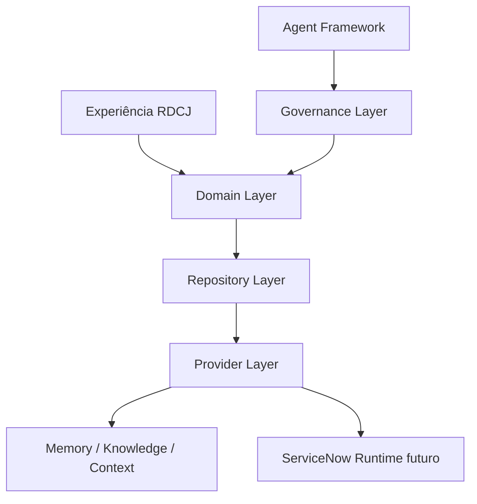
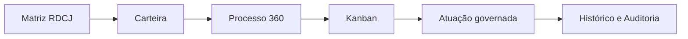
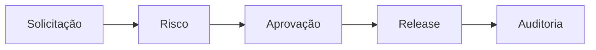
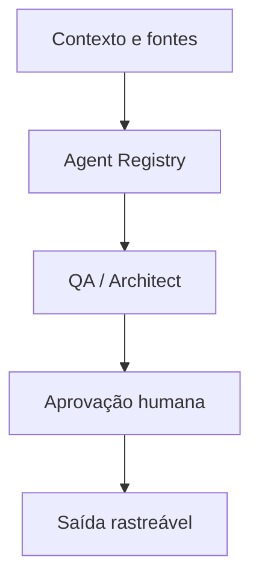
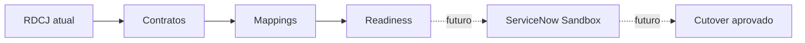

# Executive Diagrams

## Arquitetura Geral

```mermaid
flowchart TD
 UI[Experiência RDCJ] --> Domain[Domain Layer]
 Domain --> Repo[Repository Layer]
 Repo --> Provider[Provider Layer]
 Provider --> Memory[Memory / Knowledge / Context]
 Provider --> SN[ServiceNow Runtime futuro]
 Agents[Agent Framework] --> Governance[Governance Layer]
 Governance --> Domain
```

## Fluxo Operacional

```mermaid
flowchart LR
 Matrix[Matriz RDCJ] --> Portfolio[Carteira]
 Portfolio --> P360[Processo 360]
 P360 --> Kanban[Kanban]
 Kanban --> Action[Atuação governada]
 Action --> Audit[Histórico e Auditoria]
```

## Fluxo de Governança

```mermaid
flowchart LR
 Request[Solicitação] --> Risk[Risco]
 Risk --> Approval[Aprovação]
 Approval --> Release[Release]
 Release --> Audit[Auditoria]
```

## Fluxo de Agentes

```mermaid
flowchart TD
 Context[Contexto e fontes] --> Agent[Agent Registry]
 Agent --> Validate[QA / Architect]
 Validate --> Human[Aprovação humana]
 Human --> Output[Saída rastreável]
```

## Preparação ServiceNow

```mermaid
flowchart LR
 Current[RDCJ atual] --> Contracts[Contratos]
 Contracts --> Mapping[Mappings]
 Mapping --> Readiness[Readiness]
 Readiness -. futuro .-> Sandbox[ServiceNow Sandbox]
 Sandbox -. futuro .-> Cutover[Cutover aprovado]
```
