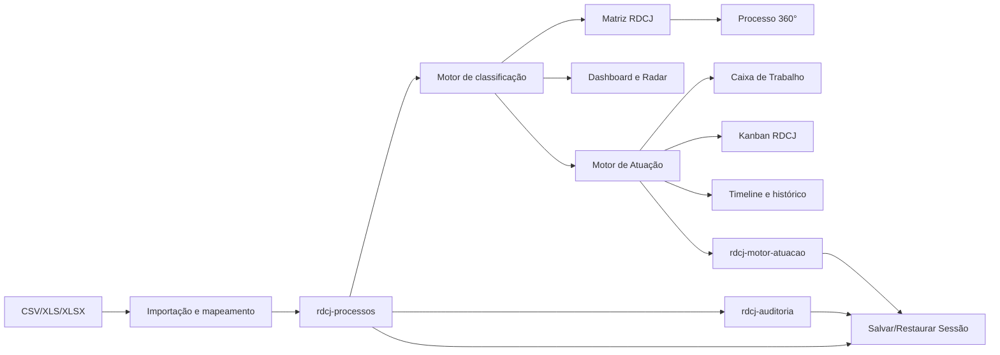

# RDCJ Mockup

Mockup funcional do RDCJ — **Risco, Decisão, Criticidade e Justiça** — para classificação e atuação operacional sobre uma carteira judicial importada.

O projeto responde a duas perguntas complementares:

1. **Onde está cada processo e por que ele está nesse quadrante?** — Matriz RDCJ.
2. **Quem deve agir, o que deve ser feito, quando e qual foi o resultado?** — Motor de Atuação e Caixa de Trabalho.

## Status atual

- Front-end estático, sem framework e sem backend.
- Entrada principal: arquivos `.xlsx`, `.xls` ou `.csv`.
- Persistência local no navegador via `localStorage`.
- Classificação matricial baseada em tempo da decisão e valor da ação.
- Processo 360° com explicação, linha de atuação, próxima ação e histórico de auditoria.
- Motor operacional baseado em máquina de estados: **estado → ação → novo estado**.
- Kanban RDCJ como camada visual de arrastar-e-soltar sobre o motor de atuação (não altera estado sozinho).
- Backup e restauração local da sessão ("Sessão RDCJ") em arquivo `.json`, sem servidor nem banco de dados.
- Menu lateral centralizado em `src/js/navigation.js`.
- Não existe pipeline de build ou conjunto de testes automatizados configurado.

> Para uma demonstração local, o projeto deve ser servido por HTTP. Abrir os arquivos diretamente com `file://` pode causar problemas com scripts, módulos e leitura de arquivos.

## Executar localmente

Na raiz do projeto (`C:\dev\RDCJ-MOCKUP`), inicie um servidor HTTP simples:

```powershell
python -m http.server 8000
```

Abra no navegador:

- `http://localhost:8000/src/index.html`
- ou diretamente `http://localhost:8000/src/pages/matriz.html`

Para parar o servidor, use `Ctrl + C` no terminal. Para atualizar sem cache, use `Ctrl + F5`.

Instruções detalhadas de pré-requisitos e primeira execução estão em [`INSTALACAO-RAPIDA.md`](INSTALACAO-RAPIDA.md).

## Documentação complementar

| Documento | Público-alvo | Conteúdo |
|---|---|---|
| [`INSTALACAO-RAPIDA.md`](INSTALACAO-RAPIDA.md) | Quem vai instalar/rodar o projeto | Pré-requisitos, passo a passo de instalação e primeira execução. |
| [`MANUAL-OPERADOR.md`](MANUAL-OPERADOR.md) | Operador do dia a dia | Uso de cada tela, passo a passo de backup e de restauração da sessão. |
| [`GUIA-DEMONSTRACAO.md`](GUIA-DEMONSTRACAO.md) | Apresentador/comercial | Roteiro executivo de demonstração de 15 minutos. |
| [`CHANGELOG.md`](CHANGELOG.md) | Equipe técnica | Histórico das entregas do mockup. |

## Estrutura recomendada para GitHub

O projeto não depende de build, então a estrutura de repositório recomendada é simples:

- **Branch única (`main`)** para o mockup de demonstração; branches de feature são opcionais, dado o volume atual de arquivos.
- **`.gitignore`** sugerido: ignorar apenas artefatos de editor/SO (`.vscode/`, `Thumbs.db`, `.DS_Store`); não há `node_modules`, build ou `.env` a ignorar.
- **Sem GitHub Actions/CI** por enquanto — não há testes automatizados nem etapa de build (ver `CHANGELOG.md` para o registro dessa limitação).
- **Releases**: usar tags leves (`vAAAA.MM.DD`) associadas às entregas descritas em `CHANGELOG.md`, já que o projeto ainda não segue versionamento semântico formal.
- **Arquivos de referência de dados** (ex.: `CRIA_S702_2026.09.17.XLS`) devem ficar na raiz apenas como massa de teste local; não é recomendado versionar planilhas reais de clientes em um repositório público.

## Estrutura do projeto

```text
RDCJ-MOCKUP/
├── README.md
├── MANUAL-OPERADOR.md             # manual de uso tela a tela
├── INSTALACAO-RAPIDA.md           # passo a passo de instalação/execução local
├── GUIA-DEMONSTRACAO.md           # roteiro executivo de demonstração (15 min)
├── CHANGELOG.md                   # histórico de entregas do mockup
├── CRIA_S702_2026.09.17.XLS       # arquivo de referência local, se necessário
└── src/
    ├── index.html                  # entrada; redireciona para a matriz
    ├── agents/                     # documentos de agentes/visões de produto
    ├── assets/                     # ícones, imagens e logo
    ├── components/                 # componentes isolados
    ├── css/                        # tokens, layout e estilos de páginas (inclui kanban.css, processo360.css)
    ├── domain/                     # contratos/regras TypeScript de domínio (paralelo, não executado)
    ├── js/                         # implementação executada pelo navegador
    ├── memory/                     # decisões, feedback e backlog do produto
    └── pages/                      # telas HTML (inclui kanban.html, processo360.html)
```

### Fonte de verdade em runtime

O navegador executa os arquivos em `src/js/`. Os arquivos em `src/domain/` são contratos e regras TypeScript paralelos; atualmente não há configuração de TypeScript, bundler ou compilação que os transforme nos arquivos JavaScript usados pelas páginas.

Ao corrigir um comportamento visual ou funcional do mockup, normalmente o arquivo correto está em `src/js/` ou `src/pages/`.

## Arquitetura de alto nível



As páginas são HTML independentes. Cada página inclui os scripts necessários em ordem e expõe objetos globais, por exemplo `rdcjMatrixUI`, `rdcjBaseManager` e `rdcjMotorAtuacao`.

## Páginas

| Página | Arquivo | Responsabilidade |
|---|---|---|
| Entrada | `src/index.html` | Redireciona para a matriz. |
| Dashboard | `src/pages/dashboard.html` | KPIs e distribuições da carteira. |
| Matriz | `src/pages/matriz.html` | Visualização N1–N9, filtros e KPIs matriciais. |
| Caixa de Trabalho | `src/pages/trabalho.html` | Filas operacionais, ações, estados e timeline. |
| Kanban RDCJ | `src/pages/kanban.html` | Camada visual de arrastar-e-soltar sobre o motor de atuação (6 raias, 24 colunas). |
| Radar | `src/pages/radar-carteira.html` | Leitura consolidada dos eixos/indicadores da carteira. |
| Importação | `src/pages/importar-carteira.html` | Leitura de CSV/XLSX, mapeamento e carga. |
| Carteira | `src/pages/carteira.html` | Lista filtrável de processos. |
| Processo 360° (atual) | `src/pages/processo360.html` | Identificação, enquadramento, linha de atuação, explicabilidade, timeline, próxima ação e evidências. Acessada pela Matriz e pelo Kanban. |
| Processo 360° (legado) | `src/pages/processo.html` | Versão anterior, mais simples. **Não está mais linkada** pela Matriz/Kanban; acessível apenas por URL direta. |
| Edição | `src/pages/editar-processo.html` | Atualização auditável dos campos editáveis. Só era alcançada a partir do Processo 360° legado; hoje acessível apenas por URL direta. |
| Configuração | `src/pages/configuracao-base.html` | Importar, substituir, limpar a carteira e gerenciar a Sessão RDCJ (backup/restauração). |
| Alertas | `src/pages/alertas.html` | Placeholder da futura central de alertas. Não está no menu principal; acessível apenas por URL direta. |
| Regras | `src/pages/motor-rdcj.html` | Explicação da regra matricial vigente. Não está no menu principal; acessível apenas por URL direta. |

> As oito páginas acessíveis pelo menu lateral (`src/js/navigation.js`) são: Dashboard, Matriz, Caixa de Trabalho, Kanban, Radar, Importação, Carteira e Configuração. As demais (Processo 360°, Processo 360° legado, Edição, Alertas, Regras) são alcançadas por links contextuais ou apenas por URL direta.

## Fluxo da carteira

1. O usuário escolhe uma planilha na tela de importação.
2. O sistema identifica/permite mapear campos como CNJ, cliente, valor e data da decisão.
3. Cada linha é normalizada e classificada.
4. A base é persistida em `localStorage`.
5. Dashboard, matriz, carteira, radar e Processo 360° leem a mesma base.
6. A Caixa de Trabalho e o Kanban RDCJ sincronizam e exibem o mesmo fluxo operacional para cada processo.
7. A qualquer momento, o operador pode gerar um backup ("Salvar Sessão") ou restaurar um backup anterior pela tela de Configuração.

### Campos de importação

O mapeamento procura aliases para:

- processo: `cnj`, `nr_prc`, `processo`, `numero`;
- cliente: `nm_lit`;
- data: `data da decisao`, `data decisao`, `dt_decisao`, `decisao`;
- valor: `valoracaomoedacorrente`, `valordaacao`, `valor da acao`, `valor`;
- terceirização: `valoracaofinsterceirizacao`, `valoracao fins terceirizacao`, `terceirizacao`;
- advogado: `nm_adv`, `advogado`;
- comarca: `nm_mun`, `comarca`;
- responsável: `responsavel`.

CNJ, cliente, valor e data da decisão são os campos mínimos exigidos pela interface de importação. Linhas com inconsistências são mantidas e marcadas para inspeção.

## Classificação da Matriz RDCJ

A implementação atual usa duas dimensões:

- **Tempo da decisão:**
  - `T1`: menos de 1 ano;
  - `T2`: de 1 a 2 anos;
  - `T3`: acima de 2 anos.
- **Valor da ação:**
  - `V1`: até `R$ 64.840,00`;
  - `V2`: até `R$ 485.040,04`;
  - `V3`: acima desse limite.

O cruzamento gera o quadrante:

| Tempo \ Valor | V1 | V2 | V3 |
|---|---:|---:|---:|
| T1 | N1 | N2 | N3 |
| T2 | N4 | N5 | N6 |
| T3 | N7 | N8 | N9 |

Pesos atuais:

| Quadrantes | Peso |
|---|---|
| N1, N2, N4 | P1 |
| N3, N5, N7 | P2 |
| N6, N8 | P3 |
| N9 | P4 |

As regras estão duplicadas, de forma equivalente, em `src/js/matriz-criticidade.js` e `src/domain/matrizCriticidade.ts`. A página usa a versão JavaScript.

## Motor de Atuação

O motor está em `src/js/motor-atuacao.js` e persiste em `rdcj-motor-atuacao`.

### Estados

- `REVISAO_JURIDICA`
- `PETICIONAMENTO`
- `AGUARDANDO_RESULTADO`
- `INVESTIGACAO_AGENCIA`
- `INVESTIGACAO_RETAGUARDA`
- `MONITORAMENTO`
- `ENCERRADO`

### Linhas de atuação

| Estado | Linha |
|---|---|
| Revisão jurídica | `ADVOGADO` |
| Peticionamento | `ADVOGADO` |
| Aguardando resultado | `ADVOGADO` |
| Investigação agência | `AGENCIA` |
| Investigação retaguarda | `CENTRAL_RETAGUARDA` |
| Monitoramento | `SISTEMA` |
| Encerrado | `SISTEMA` |

### Transições oficiais

```text
REVISAO_JURIDICA
├─ Existe oportunidade processual → PETICIONAMENTO
└─ Não existe oportunidade → INVESTIGACAO_AGENCIA

INVESTIGACAO_AGENCIA
├─ Informação relevante localizada → INVESTIGACAO_RETAGUARDA
└─ Nada localizado → MONITORAMENTO

INVESTIGACAO_RETAGUARDA
├─ Ativo localizado → PETICIONAMENTO
└─ Busca negativa → MONITORAMENTO

PETICIONAMENTO
└─ Petição protocolada → AGUARDANDO_RESULTADO

AGUARDANDO_RESULTADO
└─ Encerrar diligência → MONITORAMENTO
```

A API principal do motor é:

- `rdcjMotorAtuacao.sincronizarFluxos()` — cria o fluxo inicial para processos novos;
- `rdcjMotorAtuacao.listarFluxos()` — combina carteira, fluxo e timer;
- `rdcjMotorAtuacao.aplicarTransicao(processoId, decisao, usuario, justificativa)` — valida e executa uma transição;
- `rdcjMotorAtuacao.timelineDoProcesso(processoId)` — retorna os eventos do processo;
- `rdcjMotorAtuacao.filaJuridica()` — fila de advogado;
- `rdcjMotorAtuacao.filaAgencia()` — fila de agência;
- `rdcjMotorAtuacao.filaRetaguarda()` — fila de retaguarda.

### Timers

A próxima revisão é calculada pelo peso:

- `P4`: 90 dias;
- `P3`: 180 dias;
- `P2`: 240 dias;
- `P1`: sem revisão automática.

Os timers registram o processo, peso, próxima revisão, origem (`CLASSIFICACAO_MATRIZ`) e data de criação.

## Persistência local

| Chave | Dono | Conteúdo |
|---|---|---|
| `rdcj-processos` | `base-manager.js`, `matrix-ui.js`, `processo-repository.js` | Registros importados e editados. |
| `rdcj-base-metadata` | `base-manager.js` | Arquivo, versão, data, quantidade e status da base. |
| `rdcj-auditoria` | `auditoria.js` | Eventos de importação, edição e transição. |
| `rdcj-motor-atuacao` | `motor-atuacao.js` | Fluxos (com `coluna`/`ordem` do Kanban), históricos e timers operacionais. |
| `rdcj-sessao-status` | `sessao-rdcj.js` | Data do último backup e da última restauração. |

A base não é compartilhada entre navegadores, computadores ou usuários. Limpar a base também limpa `localStorage`, `sessionStorage`, bancos IndexedDB e caches disponíveis no navegador. O backup/restauração de "Sessão RDCJ" (ver `MANUAL-OPERADOR.md`) é a forma recomendada de levar uma demonstração de um computador para outro.

## Módulos JavaScript

- `navigation.js`: injeta e normaliza o menu lateral único.
- `base-manager.js`: importação, substituição, limpeza e metadados.
- `matrix-ui.js`: leitura da carteira, importação, filtros e renderização da matriz/lista.
- `matriz-criticidade.js`: classificação T/V → N → P.
- `matrix-engine.js`: adaptador de classificação e formatação monetária.
- `auditoria.js`: registro simples de eventos no `localStorage`.
- `processo-repository.js`: CRUD local por CNJ.
- `dashboard.js`: renderização do dashboard executivo.
- `insights-carteira.js`: agregações, distribuições e rankings.
- `radar-carteira.js`: renderização do radar operacional.
- `motor-atuacao.js`: máquina de estados, timers, filas, timeline e colunas visuais do Kanban (`coluna`/`ordem`).
- `kanban.js`: renderização das 6 raias/24 colunas e drag-and-drop (SortableJS) sobre `rdcjMotorAtuacao`.
- `processo360.js`: consolida matriz + motor + auditoria na tela de Processo 360° atual; somente leitura.
- `sessao-rdcj.js`: backup (`Salvar Sessão`) e restauração (`Restaurar Sessão`) local em `.json`.
- `decision-engine.js`: motor de score legado/experimental; não é a fonte da classificação atual da matriz. **Nenhuma página carrega este arquivo hoje** (órfão, candidato a remoção em limpeza futura).
- `app.js`: inicialização de comportamentos globais simples.

> `src/components/base-info-card.js` é um arquivo duplicado não referenciado por nenhuma página; a versão em uso é `src/js/base-info-card.js`.

## Convenções para manutenção

1. Preserve a separação entre classificação matricial e operação. A Caixa de Trabalho não deve alterar as regras da matriz.
2. Ao alterar uma regra, atualize a implementação JavaScript e o contrato TypeScript correspondente.
3. Use `rdcjBaseManager` para operações da carteira; não grave diretamente em `localStorage` fora de uma necessidade explícita.
4. Use `rdcjAuditoria.registrar()` para ações que alterem dados ou estado.
5. Novas transições devem ser adicionadas em `TRANSICOES`, com estado, linha, responsável, histórico e UI correspondentes.
6. Mantenha `navigation.js` como fonte única do menu lateral; não replique `<aside>` manualmente em novas páginas.
7. Como não há build, verifique sempre os caminhos relativos dos scripts a partir de `src/pages/`.
8. Após editar, valide com diagnóstico do VS Code e carregue a página pelo servidor HTTP.

## Limitações conhecidas

- Não há autenticação, autorização ou identidade real de usuário.
- `localStorage` não é adequado para produção, concorrência ou dados sensíveis.
- Não há API, banco de dados ou sincronização entre usuários.
- A classificação atual é tempo × valor; risco de perda, potencial de recuperação e IRP ainda não estão implementados como critérios reais.
- O motor operacional inicializa fluxos localmente, mas ainda não possui integração com sistemas processuais, patrimoniais ou de protocolo.
- A página de alertas ainda é um placeholder.
- Não há testes automatizados, lint ou CI configurados.
- Os arquivos TypeScript de `src/domain/` ainda não são compilados nem consumidos automaticamente pelo front-end.

## Próximas evoluções registradas

O backlog oficial está em `src/memory/backlog.md`. Entre os próximos temas estão:

- validação mais robusta de CSV/XLSX e erros por linha;
- versionamento das regras de enquadramento;
- melhorias de matriz, busca, seleção e exportação;
- Processo 360° com mais evidências e movimentações;
- governança da classificação;
- risco de perda, potencial de recuperação e IRP;
- persistência segura, identidade e integrações externas.

As decisões de produto estão em `src/memory/decisions-log.md`, o contexto do produto em `src/memory/product-memory.md` e os feedbacks em `src/memory/feedback-log.md`.
