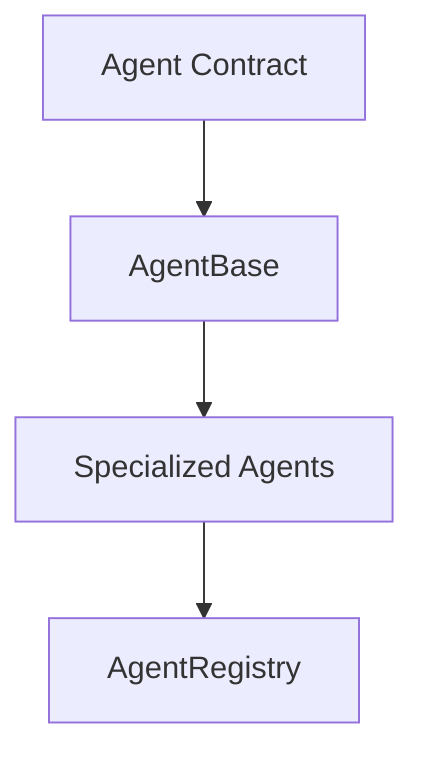
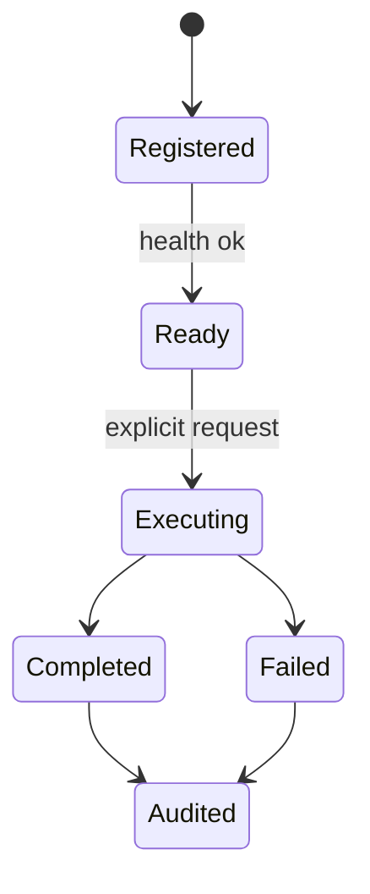
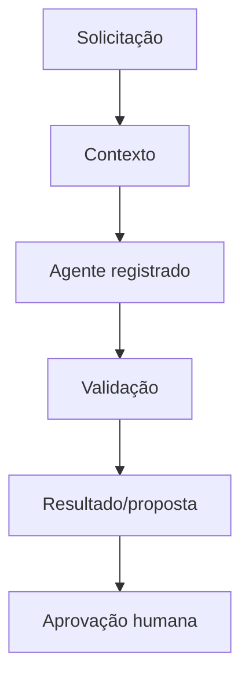
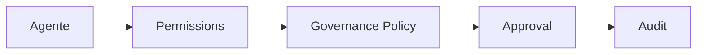
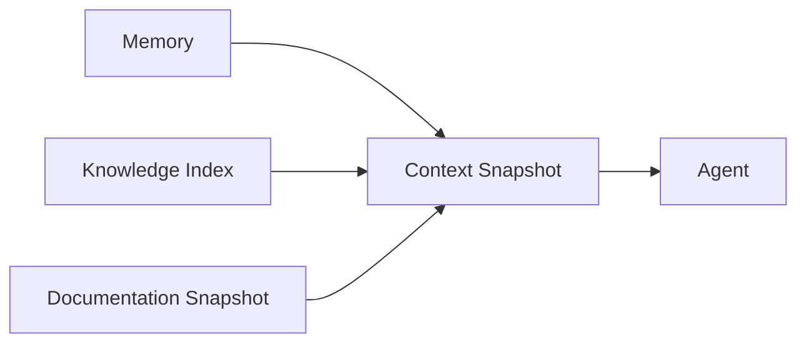
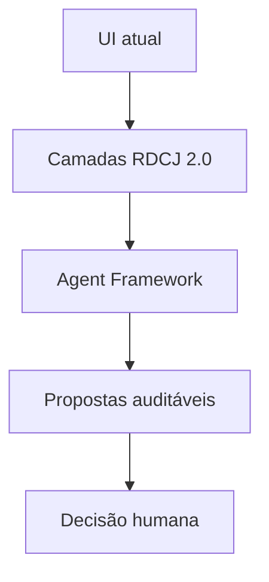

# Agent Diagrams

## Agent Architecture

```mermaid
flowchart TD
 C[Agent Contract] --> B[AgentBase]
 B --> A[Specialized Agents]
 A --> R[AgentRegistry]
```

## Agent Lifecycle

```mermaid
stateDiagram-v2
 [*] --> Registered
 Registered --> Ready: health ok
 Ready --> Executing: explicit request
 Executing --> Completed
 Executing --> Failed
 Completed --> Audited
 Failed --> Audited
```

## Agent Orchestration

```mermaid
flowchart TD
 S[Solicitação] --> C[Contexto]
 C --> A[Agente registrado]
 A --> V[Validação]
 V --> R[Resultado/proposta]
 R --> H[Aprovação humana]
```

## Agent Governance

```mermaid
flowchart LR
 A[Agente] --> P[Permissions]
 P --> G[Governance Policy]
 G --> AP[Approval]
 AP --> AUD[Audit]
```

## Agent Context Flow

```mermaid
flowchart LR
 MS[Memory] --> CTX[Context Snapshot]
 KI[Knowledge Index] --> CTX
 DOC[Documentation Snapshot] --> CTX
 CTX --> AG[Agent]
```

## RDCJ AI Architecture

```mermaid
flowchart TD
 UI[UI atual] --> LAYERS[Camadas RDCJ 2.0]
 LAYERS --> AF[Agent Framework]
 AF --> OUT[Propostas auditáveis]
 OUT --> HUMAN[Decisão humana]
```
