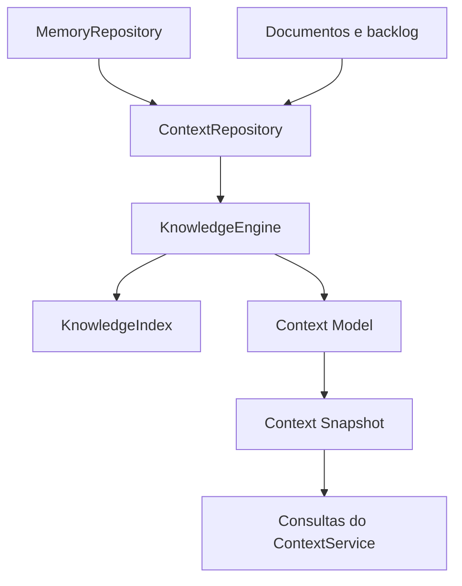
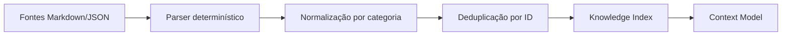
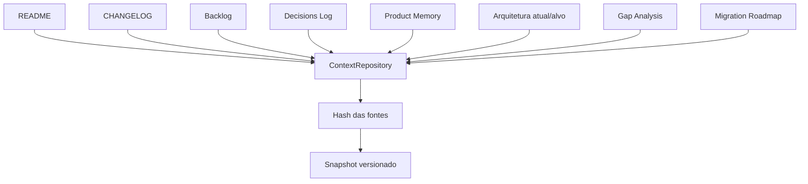
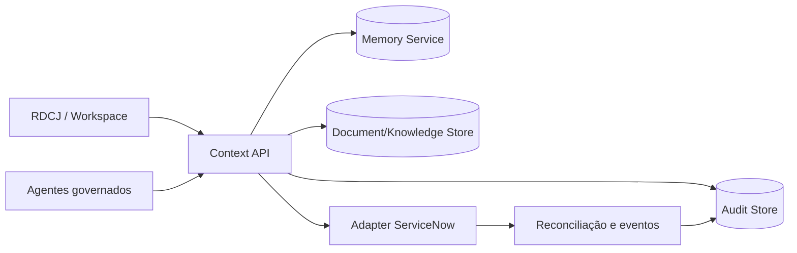

# Diagramas do Context + Knowledge Engine

## Context Flow

```mermaid
flowchart TD
    M[MemoryRepository] --> C[ContextRepository]
    D[Documentos e backlog] --> C
    C --> K[KnowledgeEngine]
    K --> I[KnowledgeIndex]
    K --> CM[Context Model]
    CM --> S[Context Snapshot]
    S --> Q[Consultas do ContextService]
```

## Knowledge Flow

```mermaid
flowchart LR
    F[Fontes Markdown/JSON] --> P[Parser determinístico]
    P --> N[Normalização por categoria]
    N --> U[Deduplicação por ID]
    U --> IDX[Knowledge Index]
    IDX --> CTX[Context Model]
```

## Document Flow

```mermaid
flowchart TD
    R[README] --> E[ContextRepository]
    C[CHANGELOG] --> E
    B[Backlog] --> E
    DL[Decisions Log] --> E
    PM[Product Memory] --> E
    A[Arquitetura atual/alvo] --> E
    G[Gap Analysis] --> E
    RM[Migration Roadmap] --> E
    E --> H[Hash das fontes]
    H --> S[Snapshot versionado]
```

## Future ServiceNow Flow

```mermaid
flowchart LR
    UI[RDCJ / Workspace] --> API[Context API]
    AG[Agentes governados] --> API
    API --> MEM[(Memory Service)]
    API --> DOC[(Document/Knowledge Store)]
    API --> AUD[(Audit Store)]
    API --> SN[Adapter ServiceNow]
    SN --> REC[Reconciliação e eventos]
    REC --> AUD
```
