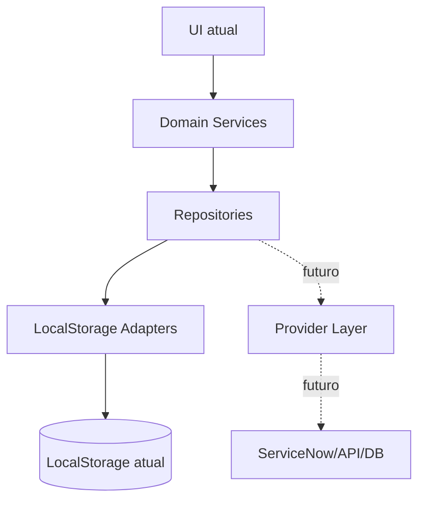

# Dependency Flow

```mermaid
flowchart TD
    UI[UI atual] --> S[Domain Services]
    S --> R[Repositories]
    R --> A[LocalStorage Adapters]
    A --> LS[(LocalStorage atual)]
    R -. futuro .-> P[Provider Layer]
    P -. futuro .-> SN[ServiceNow/API/DB]
```

A conexão acima é uma arquitetura de destino; os módulos atuais continuam usando seus próprios acessos nesta sprint.
