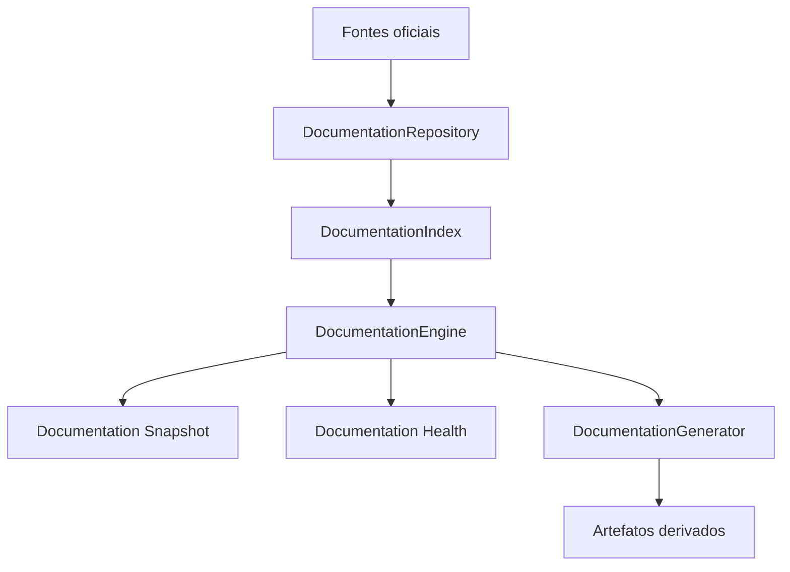
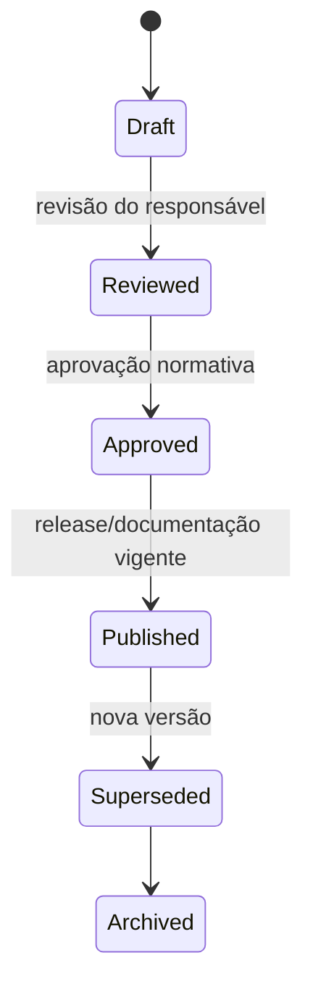
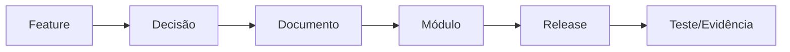
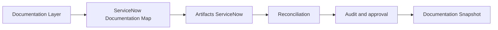

# Diagramas da Documentação Viva

## Documentation Flow

```mermaid
flowchart TD
    O[Fontes oficiais] --> R[DocumentationRepository]
    R --> I[DocumentationIndex]
    I --> E[DocumentationEngine]
    E --> S[Documentation Snapshot]
    E --> H[Documentation Health]
    E --> G[DocumentationGenerator]
    G --> D[Artefatos derivados]
```

## Documentation Lifecycle

```mermaid
stateDiagram-v2
    [*] --> Draft
    Draft --> Reviewed: revisão do responsável
    Reviewed --> Approved: aprovação normativa
    Approved --> Published: release/documentação vigente
    Published --> Superseded: nova versão
    Superseded --> Archived
```

## Traceability Flow

```mermaid
flowchart LR
    F[Feature] --> D[Decisão]
    D --> DOC[Documento]
    DOC --> M[Módulo]
    M --> R[Release]
    R --> T[Teste/Evidência]
```

## Future ServiceNow Documentation Flow

```mermaid
flowchart LR
    DOC[Documentation Layer] --> MAP[ServiceNow Documentation Map]
    MAP --> SN[Artifacts ServiceNow]
    SN --> SYNC[Reconciliation]
    SYNC --> AUD[Audit and approval]
    AUD --> SNAP[Documentation Snapshot]
```
