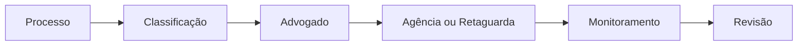
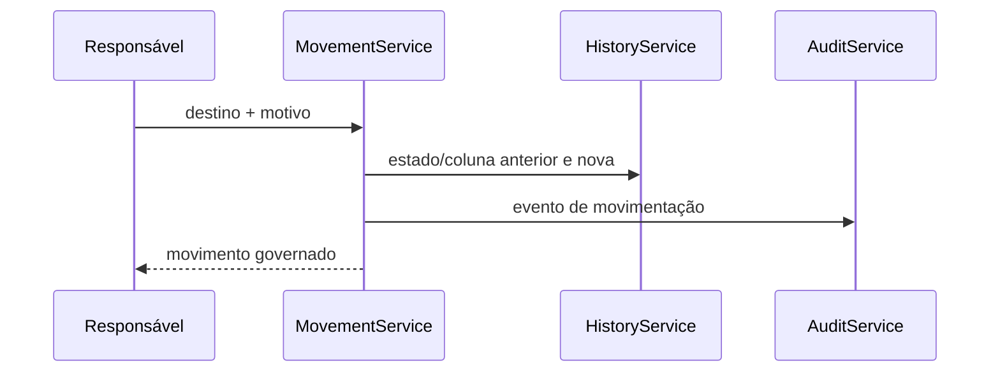
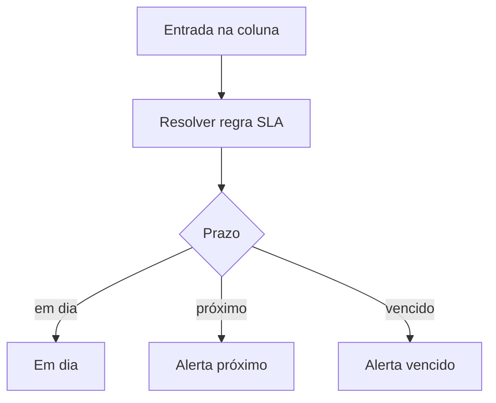
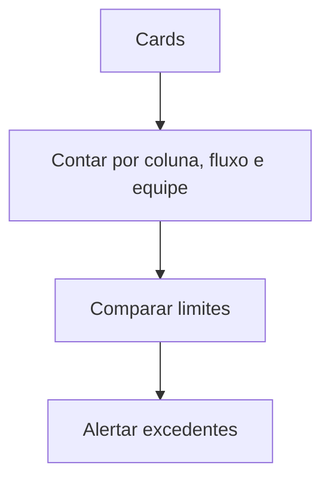
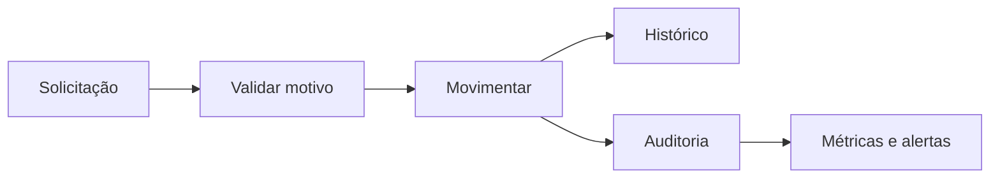
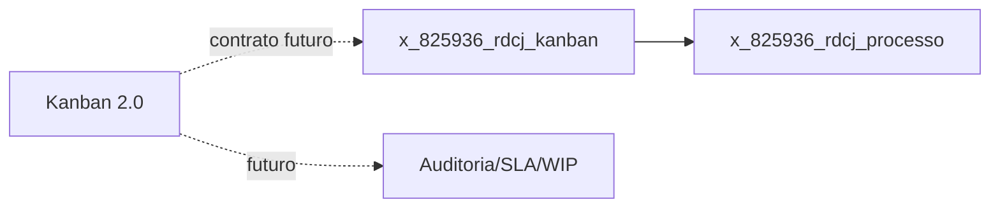

# Diagramas Kanban 2.0

## Kanban Flow

```mermaid
flowchart LR
 A[Processo] --> B[Classificação]
 B --> C[Advogado]
 C --> D[Agência ou Retaguarda]
 D --> E[Monitoramento]
 E --> F[Revisão]
```

## Movement Flow

```mermaid
sequenceDiagram
 participant U as Responsável
 participant M as MovementService
 participant H as HistoryService
 participant A as AuditService
 U->>M: destino + motivo
 M->>H: estado/coluna anterior e nova
 M->>A: evento de movimentação
 M-->>U: movimento governado
```

## SLA Flow

```mermaid
flowchart TD
 I[Entrada na coluna] --> S[Resolver regra SLA]
 S --> E{Prazo}
 E -->|em dia| OK[Em dia]
 E -->|próximo| N[Alerta próximo]
 E -->|vencido| V[Alerta vencido]
```

## WIP Flow

```mermaid
flowchart TD
 C[Cards] --> G[Contar por coluna, fluxo e equipe]
 G --> L[Comparar limites]
 L --> A[Alertar excedentes]
```

## Operational Governance

```mermaid
flowchart LR
 R[Solicitação] --> P[Validar motivo]
 P --> M[Movimentar]
 M --> H[Histórico]
 M --> A[Auditoria]
 A --> X[Métricas e alertas]
```

## ServiceNow Mapping

```mermaid
flowchart LR
 K[Kanban 2.0] -. contrato futuro .-> T[x_825936_rdcj_kanban]
 T --> P[x_825936_rdcj_processo]
 K -. futuro .-> AU[Auditoria/SLA/WIP]
```
