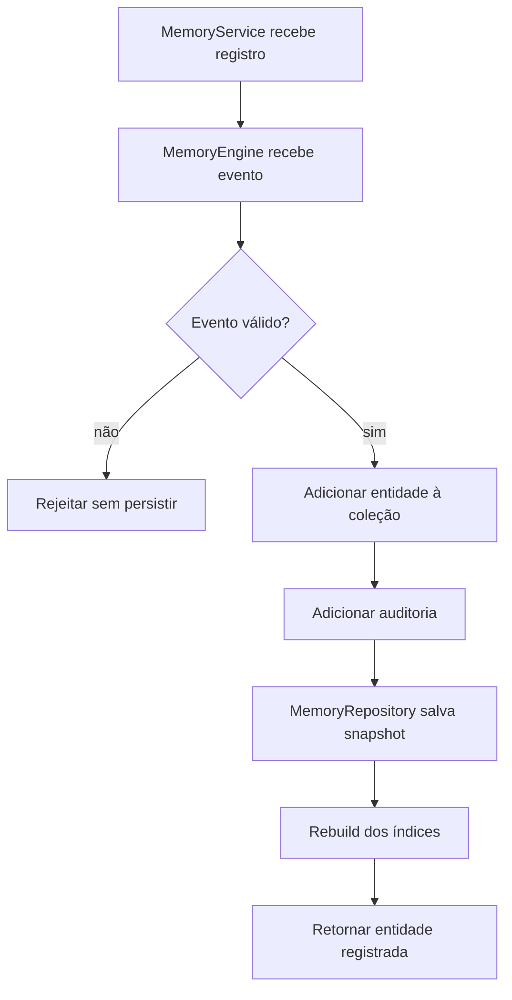
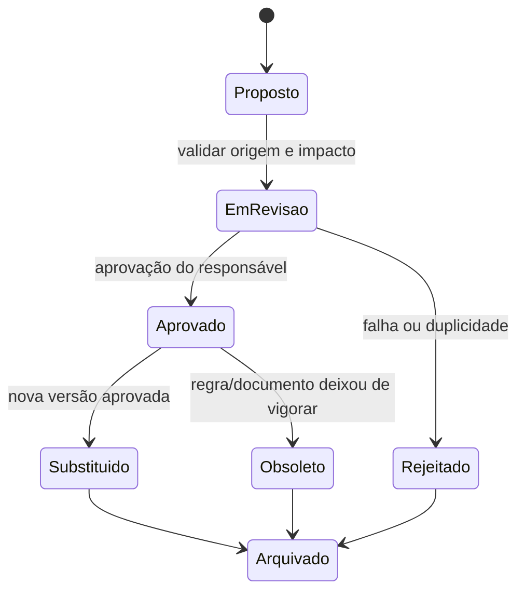
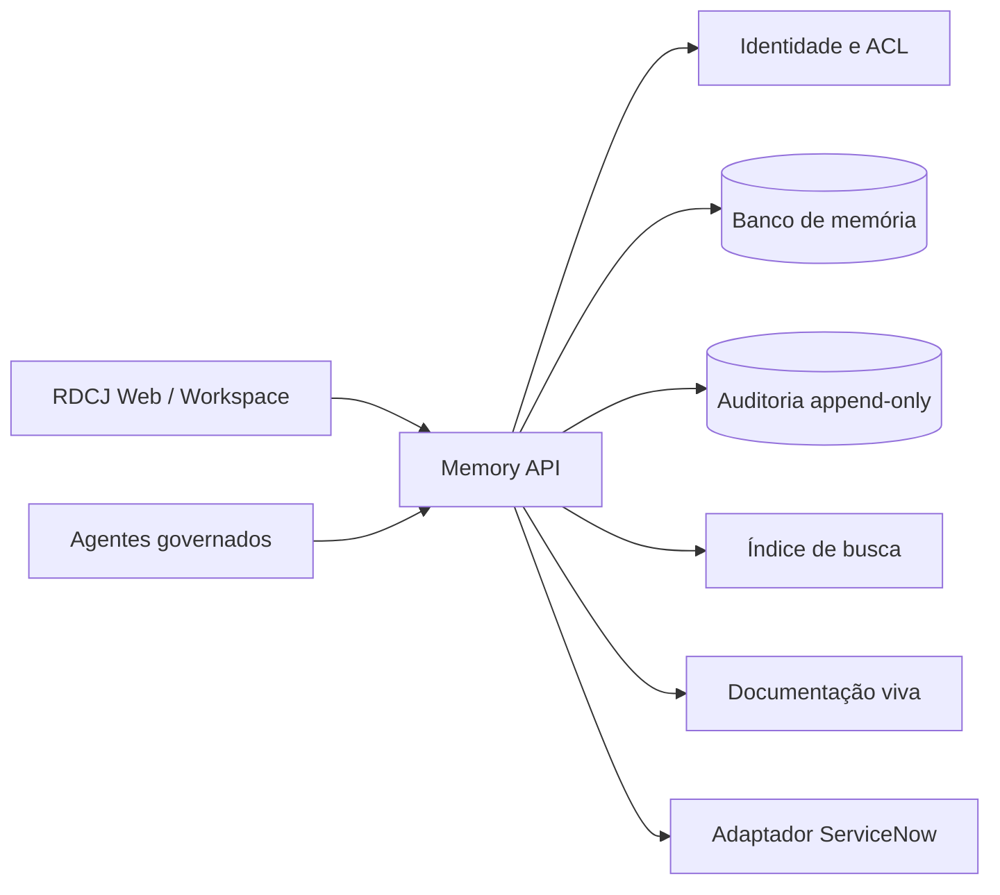
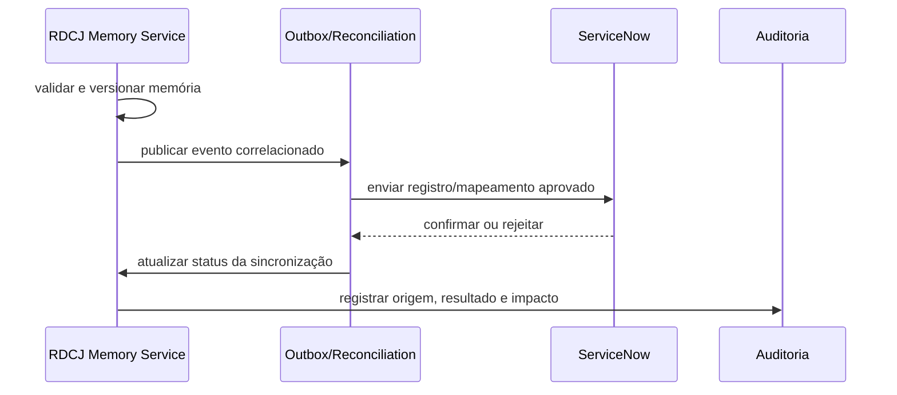

# Arquitetura da Memória Persistente — RDCJ 2.0

## Objetivo

Descrever a primeira camada técnica de memória persistente criada sobre o repositório existente, mantendo compatibilidade com o mockup atual e preparando a evolução para backend corporativo e ServiceNow.

## Arquitetura atual desta camada

```text
MemoryService
      │ registros de alto nível
      ▼
MemoryEngine
      │ valida evento, grava entidade, cria auditoria, atualiza índices
      ▼
MemoryRepository
      │ único acesso a armazenamento
      ├── localStorage (adaptador padrão local)
      └── adaptador injetado (testes/backend futuro)
      │
      ▼
memory/project-memory.json
      ├── features, modules, decisions, tasks
      ├── agents, documentation, releases
      └── audit
```

O arquivo JSON é o snapshot inicial versionado. Em runtime local, o repositório utiliza uma chave própria (`rdcj-project-memory`) e não toca nas chaves existentes do mockup.

## Fluxo da memória



## Ciclo de vida



O engine desta etapa persiste registros e auditoria; estados de aprovação são convenções de governança e podem ser usados nos itens sem alterar o mockup.

## Componentes

| Componente | Responsabilidade |
|---|---|
| `memory-schema.js` | valida estrutura mínima e entradas de auditoria |
| `memory-repository.js` | ler, salvar, atualizar e consultar histórico |
| `memory-engine.js` | coordenar evento, validação, persistência, índices e auditoria |
| `memory-service.js` | API de registro por tipo de memória |
| `memory-schema.json` | contrato declarativo |
| `tests/memory/` | regressão da infraestrutura |

## Governança

A memória persistente não é fonte de verdade para regras de classificação, estados, transições, Kanban ou auditoria operacional nesta etapa. Ela registra contexto e mudanças futuras, mantendo separação clara com:

- `rdcj-processos`;
- `rdcj-motor-atuacao`;
- `rdcj-auditoria`;
- regras em `assets/js/matriz-criticidade.js`;
- documentação histórica em `src/memory/`.

Toda mudança criada pelo novo núcleo exige contexto de auditoria. Em produção, o adaptador local deverá ser substituído por persistência server-side com identidade, ACL, retenção e trilha append-only.

## Arquitetura futura



## Integração futura com ServiceNow



O adaptador deve usar contratos versionados, IDs externos, idempotência, retries, dead-letter e reconciliação. Nenhuma integração ServiceNow é ativada por esta etapa.

## Limitações

- O armazenamento padrão ainda é local e não corporativo.
- Não há autenticação, ACL ou criptografia própria nesta camada.
- O snapshot JSON não é automaticamente carregado do arquivo físico pelo navegador.
- Índices são reconstruídos em memória; não há mecanismo de busca persistente.
- Aprovação, retenção, versionamento semântico e sincronização ainda são governança futura.
- A camada não foi integrada às páginas existentes para preservar compatibilidade.

## Roadmap da memória

1. Validar o modelo com Arquitetura, Jurídico, Segurança e Product Owner.
2. Importar decisões/documentos existentes como registros rastreáveis.
3. Adicionar versionamento de schema e migrações.
4. Criar adaptador server-side com identidade e auditoria confiável.
5. Relacionar memória a processos, regras, evidências e releases.
6. Introduzir agentes somente após políticas, fontes e human-in-the-loop.
7. Implementar adapter ServiceNow e reconciliação em sandbox.
