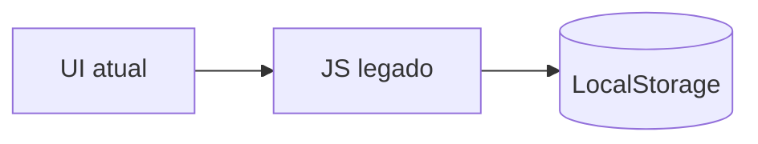
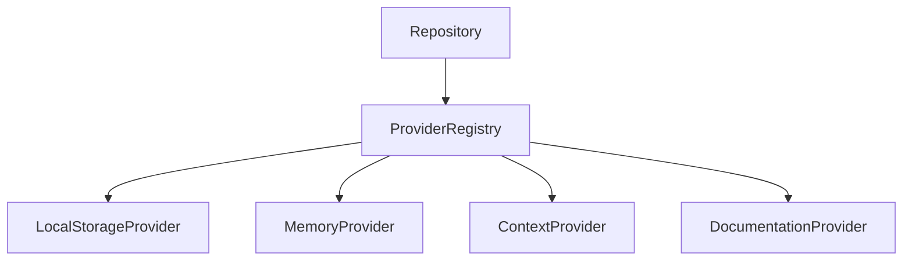
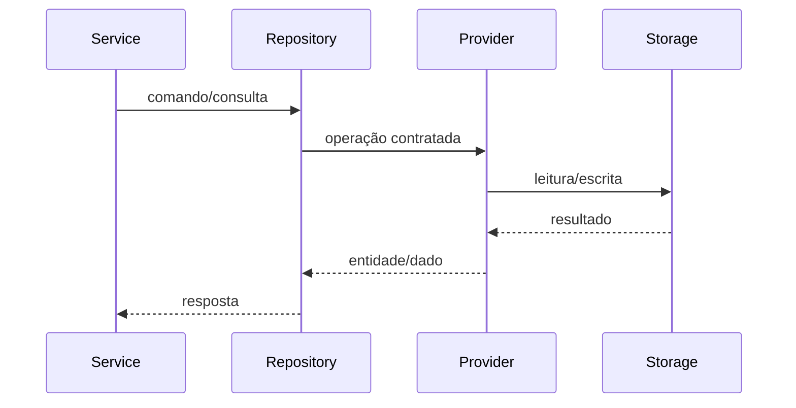
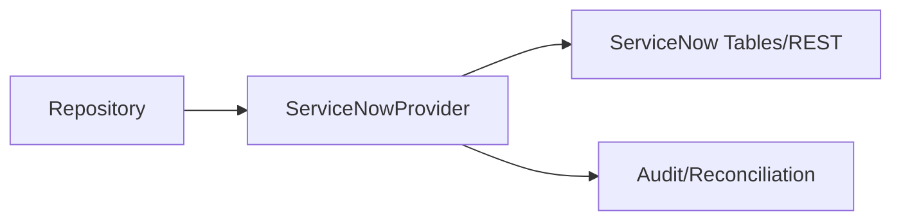
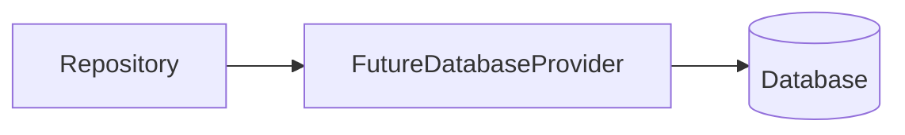
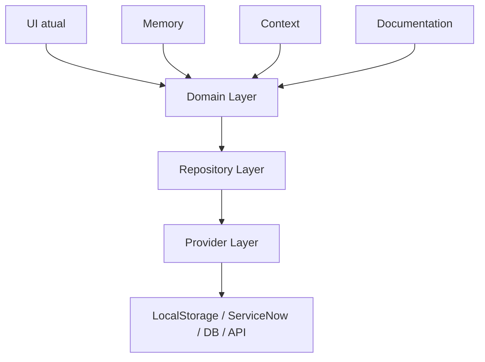

# Provider Diagrams

## Current Persistence Flow

## Provider Architecture

## Repository → Provider Flow

## Future ServiceNow Flow

## Future Database Flow

## Complete RDCJ Layered Architecture

