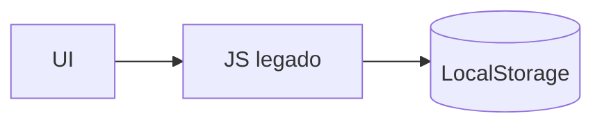
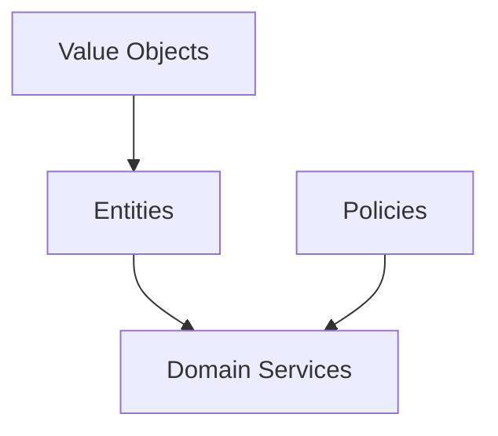
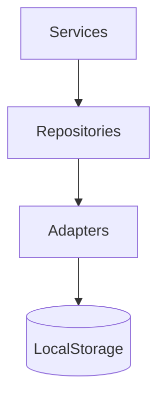
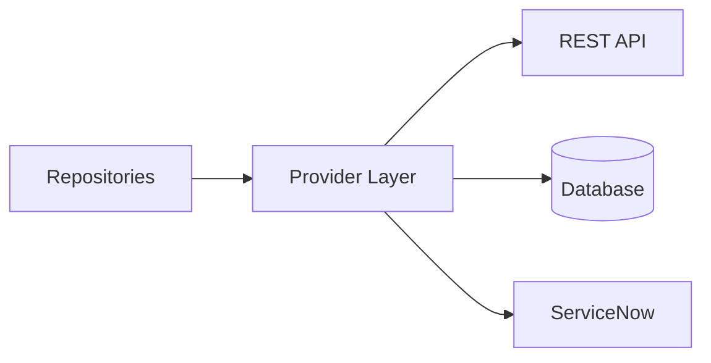
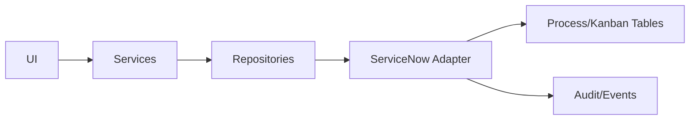
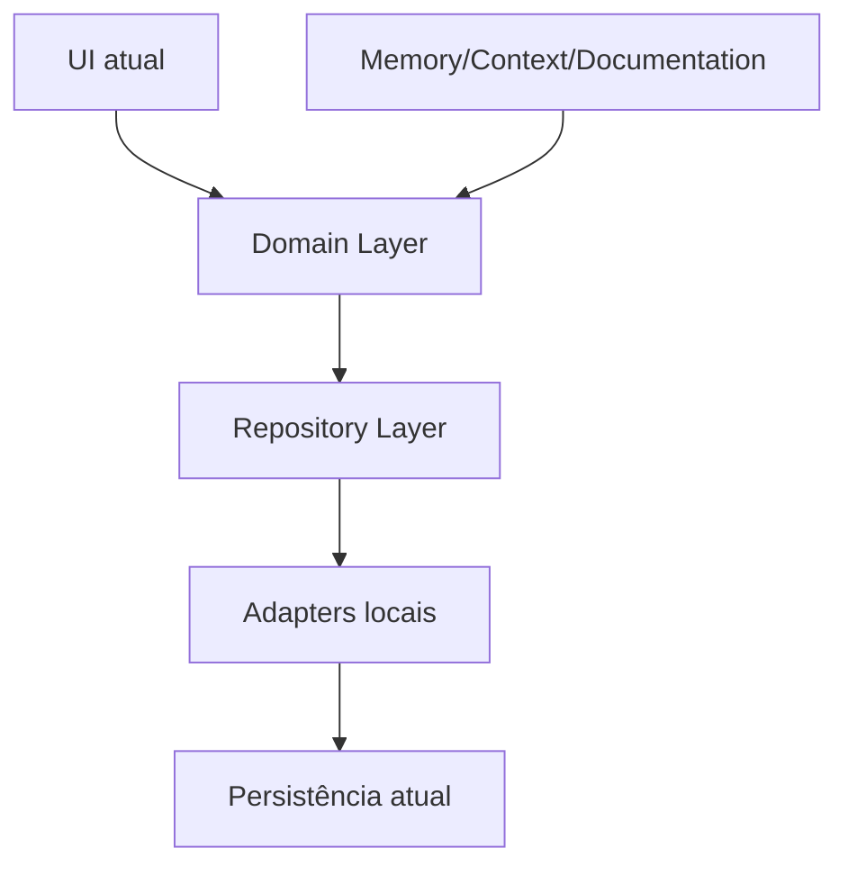

# Repository Diagrams

## Current Architecture

## Domain Architecture

## Repository Architecture

## Future Provider Architecture

## Future ServiceNow Architecture

## RDCJ 2.0 Layered Architecture

