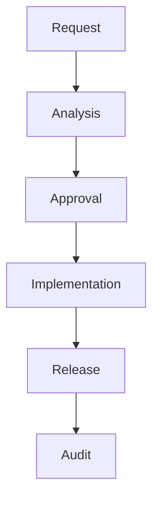
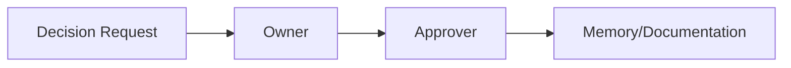
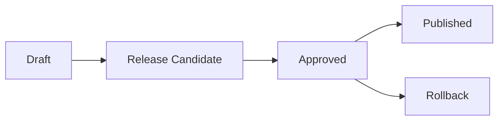
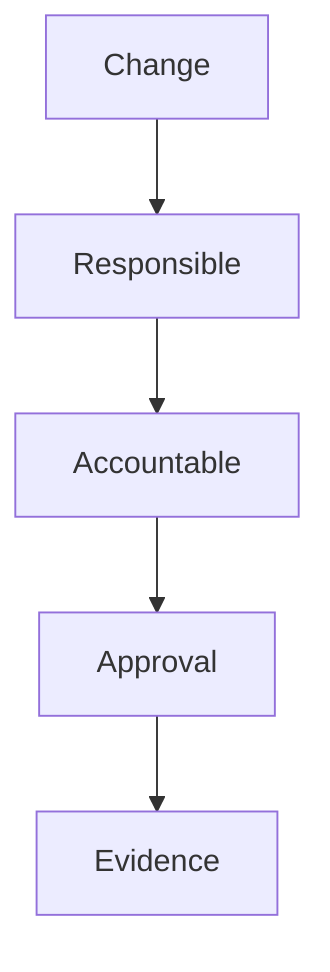
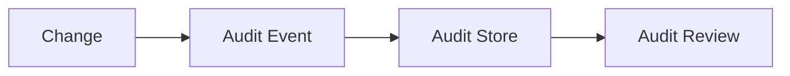
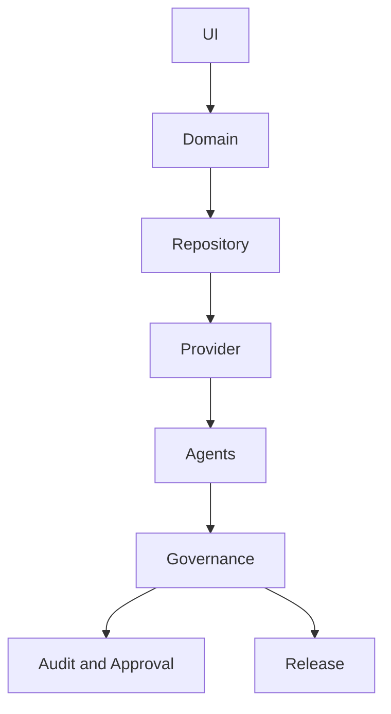

# Governance Diagrams

## Governance Architecture

```mermaid
flowchart TD
 R[Request] --> A[Analysis]
 A --> AP[Approval]
 AP --> I[Implementation]
 I --> REL[Release]
 REL --> AUD[Audit]
```

## Decision Flow

```mermaid
flowchart LR
 D[Decision Request] --> O[Owner] --> B[Approver] --> M[Memory/Documentation]
```

## Release Flow

```mermaid
flowchart LR
 Draft --> RC[Release Candidate] --> Approved --> Published
 Approved --> Rollback
```

## Approval Flow

```mermaid
flowchart TD
 C[Change] --> R[Responsible]
 R --> A[Accountable]
 A --> P[Approval]
 P --> E[Evidence]
```

## Audit Flow

```mermaid
flowchart LR
 Change --> Event[Audit Event]
 Event --> Store[Audit Store]
 Store --> Review[Audit Review]
```

## Complete RDCJ Governance Model

```mermaid
flowchart TD
 UI[UI] --> DOMAIN[Domain]
 DOMAIN --> REPO[Repository]
 REPO --> PROVIDER[Provider]
 PROVIDER --> AGENT[Agents]
 AGENT --> GOV[Governance]
 GOV --> AUDIT[Audit and Approval]
 GOV --> RELEASE[Release]
```
