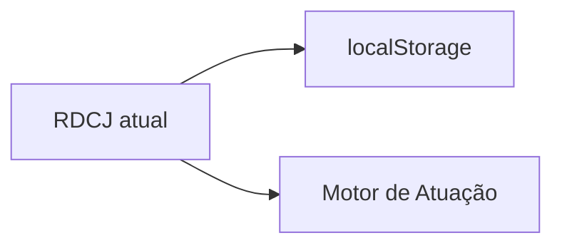
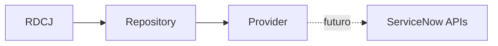
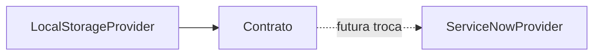
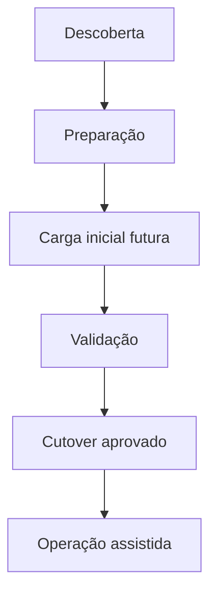
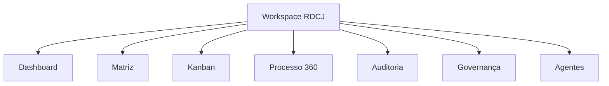
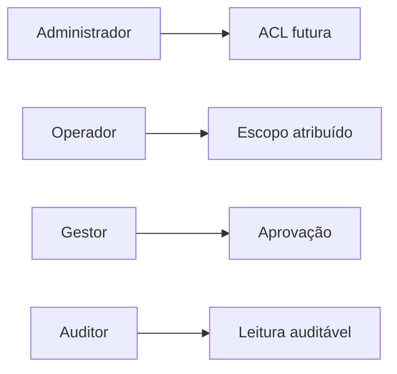
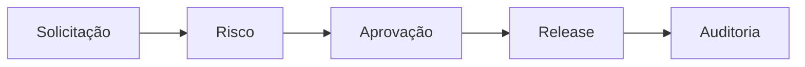

# ServiceNow Runtime Diagrams

## Current Architecture

```mermaid
flowchart LR
 UI[RDCJ atual] --> LS[localStorage]
 UI --> LEG[Motor de Atuação]
```

## Runtime Architecture

```mermaid
flowchart LR
 UI[RDCJ] --> R[Repository]
 R --> P[Provider]
 P -. futuro .-> SN[ServiceNow APIs]
```

## Provider Migration

```mermaid
flowchart LR
 L[LocalStorageProvider] --> C[Contrato]
 C -. futura troca .-> S[ServiceNowProvider]
```

## Data Migration

```mermaid
flowchart TD
 D[Descoberta] --> Prep[Preparação]
 Prep --> Load[Carga inicial futura]
 Load --> V[Validação]
 V --> Cut[Cutover aprovado]
 Cut --> Op[Operação assistida]
```

## Workspace Model

```mermaid
flowchart TD
 W[Workspace RDCJ] --> D[Dashboard]
 W --> M[Matriz]
 W --> K[Kanban]
 W --> P[Processo 360]
 W --> A[Auditoria]
 W --> G[Governança]
 W --> Ag[Agentes]
```

## Security Model

```mermaid
flowchart LR
 Admin[Administrador] --> ACL[ACL futura]
 Operador[Operador] --> Scope[Escopo atribuído]
 Gestor[Gestor] --> Approval[Aprovação]
 Auditor[Auditor] --> Read[Leitura auditável]
```

## Governance Model

```mermaid
flowchart LR
 Req[Solicitação] --> Risk[Risco]
 Risk --> Approval[Aprovação]
 Approval --> Release[Release]
 Release --> Audit[Auditoria]
```
